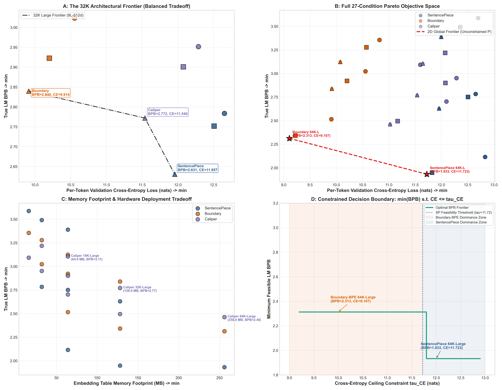
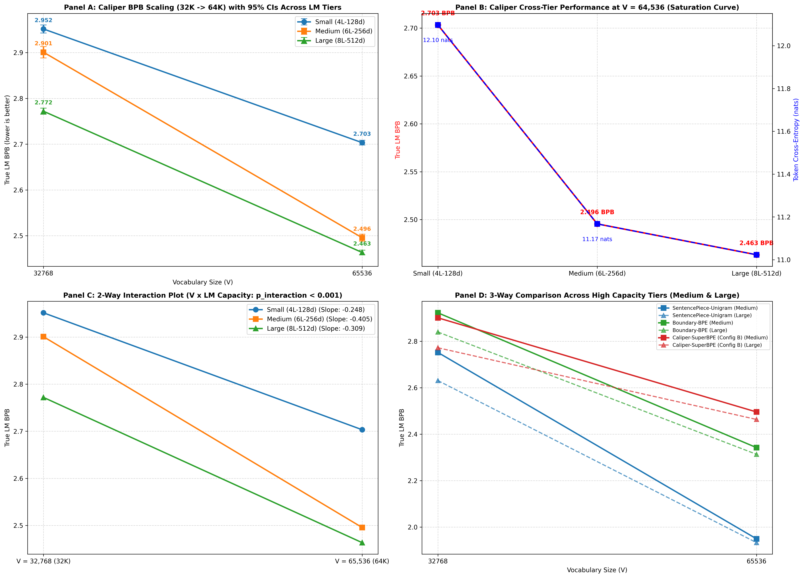
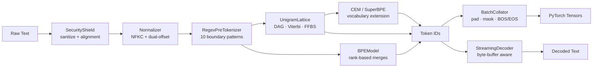
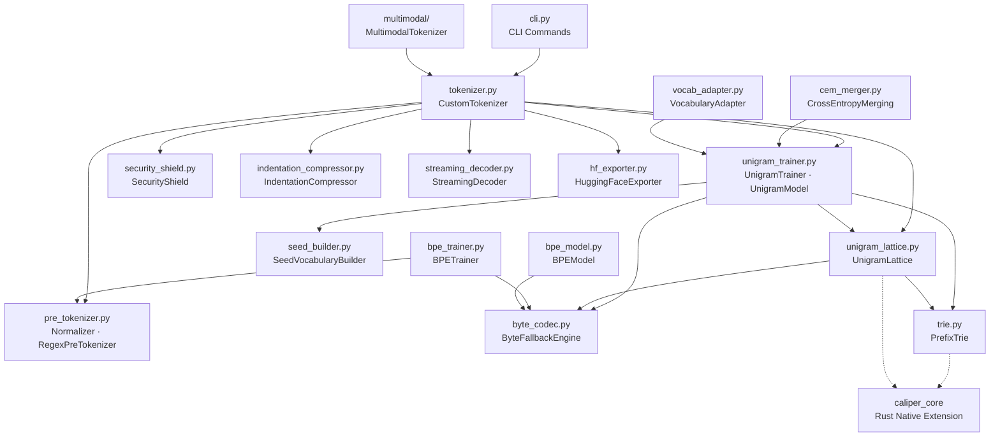

<p align="center">
  <h1 align="center">Caliper</h1>
  <p align="center">
    <strong>Script-Aware, Entropy-Guided Multilingual Subword Tokenizer</strong>
  </p>
  <p align="center">
    Zero-dependency pure Python — with byte-fallback, exact character-span tracking, and empirically validated downstream LM performance across 27 controlled experimental conditions.
  </p>
</p>

<p align="center">
  <a href="https://github.com/umran666/caliper/actions/workflows/ci.yml"></a>
  <a href="https://github.com/umran666/caliper/blob/main/LICENSE"></a>
  
  
  
</p>

---

## Overview

Most production tokenizers lean on a compiled C++ or Rust backend (SentencePiece, HuggingFace `tokenizers`) and treat character-offset alignment, control-token injection defense, and vocabulary extension as afterthoughts. **Caliper** is a single, dependency-free Python package that treats all three as first-class design constraints, while implementing the same core algorithms — Unigram Language Model segmentation, Byte-Pair Encoding, and post-training vocabulary merging — that back today's production LLM tokenizers.

What distinguishes Caliper from standard subword tokenizers is its **script-aware candidate generation** and **entropy-guided vocabulary construction**, which produce higher byte efficiency than Boundary-BPE while retaining lower token-level cross-entropy than SentencePiece under controlled compute and capacity regimes.

### Design Goals

| # | Production Failure Mode | Caliper's Response |
|:-:|:---|:---|
| 1 | **Out-of-vocabulary catastrophe** — rare Unicode, emoji, or foreign scripts silently collapse to `<unk>`, destroying information. | Strict **byte fallback**: any character outside the vocabulary decomposes into its raw UTF-8 bytes (`<0x00>`–`<0xFF>`), guaranteeing a **0% OOV rate** and exact, lossless roundtrip decoding. |
| 2 | **Span drift** — normalization (NFKC, case folding) changes string length, breaking the character offsets that NER, extractive QA, and citation systems depend on. | **Dual-offset tracking**: sanitization, indentation compression, normalization, and pre-tokenization each produce their own alignment, composed end-to-end by `_compose_alignment()`, so `encode_with_offsets()` returns a `Token.raw_span` pointing to the exact byte range in the original raw text. |
| 3 | **Digit and script clumping** — numbers and mixed scripts get fused into arbitrary tokens, hurting arithmetic reasoning and URL parsing. | A **10-pattern regex boundary layer** isolates URLs, emails, hashtags, emoji (including ZWJ sequences), CJK ideographs, and digit runs before subword segmentation ever runs. |
| 4 | **Deterministic brittleness** — a single fixed segmentation makes models fragile to typos and spelling variants. | **FFBS subword regularization** — Forward-Filtering Backward-Sampling over the segmentation lattice — samples stochastic alternative segmentations during training ([Kudo, 2018](#algorithms--base-papers)). |
| 5 | **Vocabulary freezing** — extending a trained vocabulary normally forces re-indexing, corrupting the model's existing embedding matrix. | **Non-destructive vocabulary growth**: both `VocabularyAdapter` and `CrossEntropyMerging` append new tokens at `id = len(old_vocab) + i`, leaving every existing token ID and embedding row untouched. |

---

## Research Results

Caliper has been evaluated through a controlled **3 × 3 × 3 factorial experiment** spanning 27 conditions across 3 vocabulary scales (16K, 32K, 64K), 3 Transformer LM capacity tiers (4L-128d, 6L-256d, 8L-512d), and 5 paired random seeds (N=171 total runs) under matched analytical compute (5.0 × 10¹² FLOPs).

> **Core Finding:** Caliper is not a universal replacement for SentencePiece or BPE. It occupies a distinct middle regime in which script-aware candidate generation and entropy-guided merging produce higher byte efficiency than Boundary-BPE while retaining lower token-level cross-entropy than SentencePiece under the tested compute and capacity regimes.

### The 32K Three-Way Pareto Compromise

At the 32K × Large (8L-512d) configuration, the three tokenizers form a strict, non-dominated three-way tradeoff:

| Tokenizer | True LM BPB ↓ | Per-Token CE (nats) ↓ | Bytes / Token ↑ | Active Vocab % |
|:---|:---:|:---:|:---:|:---:|
| **SentencePiece-Unigram** | **2.631** | 11.957 | **6.56** | 68.0% |
| **Caliper-SuperBPE** | 2.772 | 11.540 | 6.01 | **75.6%** |
| **Boundary-BPE** | 2.840 | **9.914** | 5.04 | 63.1% |

- SentencePiece achieves the best text compression (lowest BPB) but produces the hardest-to-predict tokens (highest CE).
- Boundary-BPE produces the most predictable tokens (lowest CE) but compresses the least (highest BPB).
- **Caliper sits between both endpoints on both objectives**, with the highest active vocabulary utilization (75.6%).

<p align="center">
  
  <br/>
  <em>Figure 1: Multi-objective Pareto analysis across 27 conditions. Panel A: 32K three-way architectural frontier. Panel B: Full 27-condition BPB vs CE landscape. Panel C: Embedding memory vs BPB scaling. Panel D: Constrained decision boundary under CE threshold.</em>
</p>

### Tokenizer–LM Capacity Interaction

A two-way repeated-measures ANOVA confirms that vocabulary scaling and downstream Transformer capacity are statistically coupled:

| Source | F-Statistic | p-value |
|:---|:---:|:---:|
| Vocabulary Scale (V) | F(1, 4) = 8,388.21 | 8.52 × 10⁻⁸ |
| LM Capacity | F(2, 8) = 7,147.02 | 9.79 × 10⁻¹⁴ |
| **Interaction (V × Capacity)** | **F(2, 8) = 425.71** | **7.51 × 10⁻⁹** |

Key findings from pre-registered hypothesis tests (N=5 seeds, Holm-Bonferroni corrected):
- Scaling from 32K→64K at Medium capacity yields **−0.405 BPB** improvement (t(4) = −70.10, p = 2.48 × 10⁻⁷)
- At 64K, Small→Medium yields **−0.208 BPB** improvement; Medium→Large yields only **−0.032 BPB** — a clear diminishing-return pattern indicating a 6L-256d capacity threshold

<p align="center">
  
  <br/>
  <em>Figure 2: Confirmatory factorial scaling experiment (5 paired seeds × 3 tokenizers × 2 vocab scales × 3 LM tiers). Left: BPB scaling curves showing vocabulary–capacity interaction. Right: ANOVA interaction diagnostics confirming F(2, 8) = 425.71, p = 7.51 × 10⁻⁹.</em>
</p>

### Memory-Budget Scaling

Embedding memory scales linearly with vocabulary size. Caliper's low-capacity efficiency makes it competitive at constrained budgets:

| Vocab | Embed Memory | Caliper BPB (Small) | Caliper B/Tok | Active Vocab % |
|:---:|:---:|:---:|:---:|:---:|
| 16K | 16 MB | 3.093 | 5.41 | 87.6% |
| 32K | 32 MB | 2.952 | 6.01 | 75.6% |
| 64K | 64 MB | 2.703 | 6.46 | 58.7% |

> Caliper achieves the lowest BPB among all evaluated 16K configurations (3.093 BPB at 5.0M parameters).

For full details, see [`PAPER_DRAFT.md`](PAPER_DRAFT.md) and the frozen dataset in [`benchmarks/phase_fifteen_final_paper_records.json`](benchmarks/phase_fifteen_final_paper_records.json).

---

## Features

<table>
<tr><td>

**Tokenization**
- Three trainable algorithms: Unigram LM (DAG + Viterbi + EM + FFBS), BPE, and CEM/SuperBPE vocabulary extension
- Byte-fallback codec for 0% OOV across all Unicode
- FFBS subword regularization for training-time augmentation
- PrefixTrie for O(L) single-pass lattice edge mining

</td><td>

**Alignment & Safety**
- Exact dual-offset span tracking (raw → normalized → token)
- SecurityShield: control-token injection / delimiter-hijacking defense
- Indic virama, Arabic harakat, Hebrew niqqud, Hangul jamo cluster protection
- CJK isolation, emoji ZWJ/variation-selector preservation

</td></tr>
<tr><td>

**Serving**
- StreamingDecoder with UTF-8 byte-buffer for real-time generation
- BatchCollator with padding, attention masks, BOS/EOS injection
- PyTorch tensor output via `to_torch()`
- HuggingFace-compatible export (`tokenizer.json` schema)

</td><td>

**Code & Domain**
- IndentationCompressor: reversible 2/4/8/16-space and tab compression
- Non-destructive online vocabulary expansion for domain adaptation
- SuperBPE whitespace-crossing merge mode ([Liu et al., 2025](#algorithms--base-papers))
- Save/load serialization with full config preservation

</td></tr>
</table>

---

## Installation

```bash
git clone https://github.com/umran666/caliper.git
cd caliper
pip install -e .
```

**Optional extras** (defined in [`pyproject.toml`](pyproject.toml)):

| Extra | Command | What it adds |
|:------|:--------|:-------------|
| PyTorch | `pip install -e ".[torch]"` | `torch>=2.0.0` — tensor output in `BatchCollator` |
| HuggingFace | `pip install -e ".[huggingface]"` | `tokenizers>=0.13.0`, `transformers>=4.30.0` — interop & export |
| Benchmarks | `pip install -e ".[bench]"` | `sentencepiece>=0.1.99`, `tokenizers>=0.13.0` — comparison baselines |
| Testing | `pip install -e ".[test]"` | `pytest>=7.0.0`, `coverage>=7.0.0`, `ruff>=0.4.0`, `mypy>=1.8.0` |
| Everything | `pip install -e ".[all]"` | All of the above |

---

## Quickstart

### Train a Unigram tokenizer

```python
from tokenizer import CustomTokenizer

corpus = [...]  # list of training documents

tok = CustomTokenizer.train_from_corpus(
    corpus,
    target_vocab_size=32_000,
    special_tokens=["<|pad|>", "<|unk|>", "<|bos|>", "<|eos|>"],
    byte_fallback=True,
)

# Encode → decode roundtrip
ids = tok.encode_to_ids("fix in 2024 at https://site.com")
text = tok.decode(ids)
assert text == "fix in 2024 at https://site.com"

# Stochastic subword regularization (training-time augmentation)
sampled = tok.sample("hello world", alpha=0.5)

# Exact character-span offsets for every token
for token in tok.encode_with_offsets("fix in 2024"):
    print(f"{token.text!r:>12}  id={token.id:<5}  raw_span={token.raw_span}")
```

### Train a BPE tokenizer

```python
from bpe_trainer import BPETrainer

trainer = BPETrainer(target_vocab_size=32_000, byte_fallback=True)
model = trainer.train(chunks=corpus, verbose=True)

tokens = model.encode("tokenization")
text = model.decode(token_ids)
```

### Extend vocabulary with CEM / SuperBPE

```python
from cem_merger import CrossEntropyMerging

# Standard CEM: greedily add merges that minimize cross-entropy increase
cem = CrossEntropyMerging(max_merges=200, verbose=True)
extended = cem.optimize(tok.model, chunks=corpus)

# SuperBPE mode: only accept merges that cross whitespace boundaries
superbpe = CrossEntropyMerging(max_merges=200, cross_word=True)
superbpe_model = superbpe.optimize(tok.model, chunks=corpus)
```

### Export to HuggingFace format

```python
tok.export_to_huggingface("hf_export/")

# Then load with transformers:
# from transformers import AutoTokenizer
# hf_tok = AutoTokenizer.from_pretrained("hf_export/")
```

### Streaming decode

```python
decoder = tok.get_streaming_decoder()

output = ""
for token_id in generated_ids:  # one id at a time from an LLM
    output += decoder.feed_token_id(token_id)
output += decoder.flush()
```

### Sanitize untrusted input

```python
from security_shield import SecurityShield

shield = SecurityShield(special_tokens=["<|endoftext|>", "<|system|>", "<|user|>"])
safe = shield.sanitize(
    untrusted_input,
    allowed_special="none",  # or {"<|user|>"} to whitelist
    disallowed_special_action="escape",  # "escape" | "raise" | "ignore"
)
```

> **Note:** `CustomTokenizer` wires `SecurityShield.sanitize()` into every `encode()`, `sample()`, and `encode_with_offsets()` call automatically (defaults: `allowed_special="none"`, `disallowed_special_action="escape"`), so sanitization is not an opt-in step.

### Compress structured whitespace

```python
from indentation_compressor import IndentationCompressor

compact = IndentationCompressor.compress_indents(source_code)
restored = IndentationCompressor.decompress_indents(compact)
assert restored == source_code
```

### Save and load

```python
tok.save("saved_model/")
tok2 = CustomTokenizer.load("saved_model/")

assert tok2.encode_to_ids("test") == tok.encode_to_ids("test")
```

---

## Command-Line Interface (CLI)

Caliper ships with a production CLI executable (`caliper`) for training, encoding, decoding, and evaluation:

```bash
# 1. Train a tokenizer with PMI ranking and SuperBPE optimization
caliper train --corpus dataset.txt --vocab-size 8000 --ranking-strategy pmi --superbpe-merges 100 --out ./model

# 2. Tokenize text with exact character spans and compression telemetry
caliper encode --model ./model --input "def forward(x): return self.attn(x)" --with-metrics

# 3. Encode to integer IDs as JSON
caliper encode --model ./model --input "the quick brown fox" --to-ids --json

# 4. Decode integer IDs losslessly
caliper decode --model ./model --input "[12, 450, 89, 230]"

# 5. Run the empirical multilingual benchmark suite with Markdown/LaTeX export
caliper benchmark --export-markdown benchmark_report.md --export-latex table.tex

# 6. Evaluate downstream LLM context efficiency and information density
caliper eval-downstream --vocab-size 1000
```

---

## Architecture

### End-to-End Pipeline



### Project Structure

```
caliper/
├── cli.py                    # Unified production CLI interface
├── tokenizer.py              # CustomTokenizer — unified facade + parallel batching
├── pre_tokenizer.py           # Normalizer + RegexPreTokenizer (10 patterns)
├── byte_codec.py              # ByteFallbackEngine — UTF-8 ↔ <0xHH> codec
├── trie.py                    # PrefixTrie — slots-optimized O(L) prefix matching
│
├── caliper_core/              # Native Rust acceleration crate (PyO3 C-extension)
│   ├── Cargo.toml             # Rust package manifest (pyo3, rayon, ahash)
│   ├── src/trie.rs            # Native Double-Array / PrefixTrie matching
│   ├── src/viterbi.rs         # Native dynamic programming Viterbi & EM expectations
│   └── src/lib.rs             # PyO3 module interface
│
├── seed_builder.py            # SeedVocabularyBuilder — PMI + script balancing + entropy
├── unigram_lattice.py         # UnigramLattice — DAG, beam pruning, EM stats, FFBS
├── unigram_trainer.py         # UnigramTrainer — EM early-stopping + Viterbi memoization
├── vocab_adapter.py           # VocabularyAdapter — non-destructive vocab expansion
├── cem_merger.py              # CrossEntropyMerging — CEM / SuperBPE extension
│
├── bpe_trainer.py             # BPETrainer — classic greedy pairwise-merge training
├── bpe_model.py               # BPEModel — rank-based merge inference (tiktoken-style)
│
├── batch_collator.py          # BatchCollator — padding, masks, BOS/EOS, to_torch()
├── streaming_decoder.py       # StreamingDecoder — incremental UTF-8-safe decode
├── hf_exporter.py             # HuggingFaceExporter — tokenizer.json + config export
│
├── security_shield.py         # SecurityShield — control-token injection defense
├── indentation_compressor.py  # IndentationCompressor — reversible whitespace codec
│
├── multimodal/
│   ├── multimodal_tokenizer.py  # MultimodalTokenizer — text + image + audio
│   ├── visual_codebook.py       # VisualCodebook — VQ codebook for image patches
│   ├── image_patcher.py         # ImagePatcher — grid-based patch extraction
│   ├── audio_codec.py           # ResidualVectorQuantizer — RVQ for audio
│   └── neural_codecs.py         # NeuralVisualCodec / NeuralAudioCodec (PyTorch)
│
├── benchmarks/
│   ├── benchmark_suite.py               # TokenizerBenchmarkSuite — 7-axis evaluation
│   ├── downstream_eval.py               # DownstreamEvaluator — context efficiency & BPB
│   ├── train_toy_transformer.py         # Downstream LLM pretraining & BPB validation
│   ├── run_final_paper_audit.py         # Phase 15 publication audit & Pareto analysis
│   ├── run_phase_fourteen_confirmatory.py  # Phase 14B 5-seed factorial ANOVA
│   └── phase_fifteen_final_paper_records.json  # Frozen audited dataset (27 conditions)
│
├── caliper_core.pyi           # Static typing stub for PyO3 C-extension
├── PAPER_DRAFT.md             # Research manuscript draft
│
├── test_tokenizer.py          # 68 unit tests across 19 test classes
├── test_adversarial_stress.py # 7 pathological input & 100K-char stress tests
├── test_batch_parity.py       # 4 batch vs single encoding parity tests
├── test_cli.py                # 6 CLI integration & roundtrip tests
├── test_downstream_model.py   # 4 Downstream transformer pretraining & BPB tests
├── test_fuzz_properties.py    # 7 property-based fuzz tests
├── test_metric_audit.py       # 2 metric accounting invariant tests
├── test_rust_parity.py        # 2 Rust/Python parity verification tests
├── pyproject.toml             # Package config, CLI console_scripts, extras
└── .github/workflows/ci.yml  # CI: 3 OS × 4 Python versions = 12-cell matrix
```

### Module Dependency Graph



---

## Algorithms & Base Papers

Caliper is an independent, from-scratch implementation. It does not wrap any paper's reference code. The algorithms are drawn from:

| Algorithm | Module(s) | Reference |
|:----------|:----------|:----------|
| Unigram LM segmentation (DAG, Viterbi, EM, FFBS sampling) | `unigram_lattice.py`, `unigram_trainer.py` | Taku Kudo. *"Subword Regularization: Improving Neural Network Translation Models with Multiple Subword Candidates."* ACL 2018. |
| Byte-Pair Encoding | `bpe_trainer.py`, `bpe_model.py` | Rico Sennrich, Barry Haddow, Alexandra Birch. *"Neural Machine Translation of Rare Words with Subword Units."* ACL 2016. |
| Cross-Entropy Merging (CEM) | `cem_merger.py` | Leonidas Gee, Leonardo Rigutini, Marco Ernandes, Andrea Zugarini. *"Multi-Word Tokenization for Sequence Compression."* EMNLP 2023 (arXiv:2402.09949). |
| SuperBPE ("Space Travel") | `cem_merger.py` (`cross_word=True`) | Alisa Liu, Jonathan Hayase, Valentin Hofmann, Sewoong Oh, Noah A. Smith, Yejin Choi. *"SuperBPE: Space Travel for Language Models."* COLM 2025 (arXiv:2503.13423). |

---

## Security Model

`SecurityShield` guards against control-token smuggling and delimiter hijacking — e.g., a user injecting a literal `<|endoftext|>` or `<|system|>` string to manipulate a model's context boundary.

| Policy | Behavior |
|:-------|:---------|
| `"escape"` | Neutralizes the control sequence in place (default) |
| `"raise"` | Raises `ValueError`, rejecting the input |
| `"ignore"` | Passes the sequence through unmodified |

The `allowed_special` parameter accepts `"all"`, `"none"`, or a specific `set` of control tokens to whitelist. Sanitization preserves character-alignment tracking via `sanitize_with_alignment()`.

`CustomTokenizer` integrates this automatically — every `encode()`, `sample()`, and `encode_with_offsets()` call runs through `SecurityShield.sanitize()` first.

---

## External-Format Compatibility

### tiktoken ranks importer

Caliper loads any tiktoken `.tiktoken` rank file (e.g. `cl100k_base.tiktoken`, `o200k_base.tiktoken`, `gpt2` via tiktoken's file dump) and produces **exactly the same integer IDs** as tiktoken — no tiktoken package required, only the lightweight `regex` module for pattern fidelity:

```python
from tiktoken_adapter import TiktokenEncoding

enc = TiktokenEncoding.from_file(
    "cl100k_base.tiktoken",
    pattern="cl100k_base",
    special_tokens={"<|endoftext|>": 100257, "<|fim_prefix|>": 100258},
)
ids = enc.encode("Hello, world!")            # identical to tiktoken.encode()
text = enc.decode(ids)
```

`to_caliper_bpe_model()` additionally converts the ranks into Caliper's native `BPEModel` (IDs preserved) for reuse in training/analysis. CI runs token-for-token differential tests against the real `tiktoken` package on multilingual, emoji/ZWJ, and code inputs.

---

## Testing & CI

### Test Suite

| Suite | Tests | Scope |
|:------|------:|:------|
| `test_tokenizer.py` | 68 | 19 test classes covering normalization, byte-fallback, encoding/decoding, lattice construction, training validation, batch collation, multimodal, trie, BPE, fast-path parity, HuggingFace export, security shield, indentation compression, streaming decode, audio codecs, neural codecs, CEM, SuperBPE, PMI ranking, and parallel batching |
| `test_adversarial_stress.py` | 7 | Pathological inputs: 100K-char repetitions, nested delimiter injections, Indic ZWJ/ZWNJ ligatures, raw binary streams, memoization cache invariance |
| `test_batch_parity.py` | 4 | Batch vs single-sentence encoding parity, offset span consistency, Rust batch acceleration parity |
| `test_cli.py` | 6 | Complete CLI train/encode/decode roundtrip, metrics reporting, SuperBPE training, downstream eval |
| `test_downstream_model.py` | 4 | End-to-end downstream mini-transformer pretraining and Bits-Per-Byte (BPB) convergence validation |
| `test_fuzz_properties.py` | 7 | Property-based fuzzing: roundtrip integrity, offset validity, Unicode resilience, determinism |
| `test_metric_audit.py` | 2 | Metric accounting invariants (TID-BPB formula, byte/token sums) and 12-script vocabulary distribution audit |
| `test_rust_parity.py` | 2 | Rust native extension / Python fallback parity |
| `test_tiktoken_adapter.py` | 8 | tiktoken ranks importer: exact-ID parity vs real cl100k_base, synthetic rank files, specials policy, byte fallback |
| `test_audit_regressions.py` | 8 | External-audit regressions: BPE inter-word space roundtrip, batch single/batch security parity, tab/newline batch parity, CEM deterministic merge order, strict BPE decode |
| **Total** | **118** | Run `pytest -q` for the current count — do not trust this table's total |

### CI Pipeline

The GitHub Actions [workflow](.github/workflows/ci.yml) runs on every push and PR across a **12-cell matrix** (3 OS × 4 Python versions):

| | Ubuntu | Windows | macOS |
|:---|:---:|:---:|:---:|
| Python 3.9 | ✓ | ✓ | ✓ |
| Python 3.10 | ✓ | ✓ | ✓ |
| Python 3.11 | ✓ | ✓ | ✓ |
| Python 3.12 | ✓ | ✓ | ✓ |

Each cell runs:
1. **Ruff** lint + format check
2. **Mypy** static type checking
3. **Full test suite** (unit, adversarial stress, CLI, property fuzzing)
4. **Benchmark suite** smoke test
5. **Package build** verification (`python -m build`)

### Running locally

```bash
pip install -e ".[test]"

pytest                                          # full test suite
ruff check . && ruff format --check .           # lint + format
mypy .                                          # type check
coverage run -m pytest && coverage report       # coverage
python benchmarks/benchmark_suite.py            # benchmark suite
python benchmarks/downstream_eval.py            # downstream LLM eval
```

---

## Multimodal

The `multimodal/` package extends Caliper to handle text, image, and audio inputs through a unified `MultimodalTokenizer`:

| Module | Purpose |
|:-------|:--------|
| `multimodal_tokenizer.py` | `MultimodalTokenizer` — unified text + image + audio tokenization with cross-modal token interleaving |
| `visual_codebook.py` | `VisualCodebook` — vector-quantized codebook for mapping image patches to discrete tokens |
| `image_patcher.py` | `ImagePatcher` — grid-based patch extraction from pixel arrays |
| `audio_codec.py` | `ResidualVectorQuantizer` — multi-layer residual VQ for audio waveform discretization |
| `neural_codecs.py` | `NeuralVisualCodec` / `NeuralAudioCodec` — PyTorch-based learned codecs (requires `[torch]` extra) |

---

## Contributing

1. Fork the repository and create a feature branch.
2. Install the dev toolchain:
   ```bash
   pip install -e ".[test]"
   ```
3. Keep new code within the `ruff` (line-length 120, target `py39`) and `mypy` configuration.
4. Add or update tests in `test_tokenizer.py` / `test_fuzz_properties.py` for any behavioral change.
5. Verify before opening a PR:
   ```bash
   pytest && ruff check . && mypy .
   ```

---

## License

Released under the [MIT License](LICENSE).

---

<p align="center">
  Maintained by <a href="https://github.com/umran666">@umran666</a>
</p>
