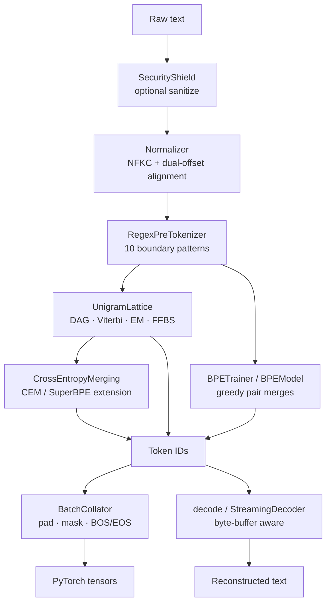

# Caliper

**A zero-dependency, high-precision Byte-Fallback Unigram and Multimodal Tokenizer**, built from scratch in pure Python — with exact character-span tracking, multilingual Unicode protection, and three interchangeable subword algorithms (Unigram LM, BPE, and CEM/SuperBPE vocabulary extension).


Most production tokenizers lean on a compiled C++ or Rust backend (SentencePiece, `tokenizers`) and treat character-offset alignment, control-token injection, and vocabulary extension as afterthoughts. Caliper is a single, dependency-free Python package that treats all three as first-class design constraints, while still implementing the same core algorithms — Unigram Language Model segmentation, Byte-Pair Encoding, and post-training vocabulary merging — that back today's production LLM tokenizers.

---

## Table of Contents

1. [Why Caliper](#why-caliper)
2. [Features](#features)
3. [Installation](#installation)
4. [Quickstart](#quickstart)
5. [Architecture and Project Structure](#architecture-and-project-structure)
6. [Algorithms and Base Papers](#algorithms-and-base-papers)
7. [Security Model](#security-model)
8. [Testing and Code Quality](#testing-and-code-quality)
9. [Multimodal and Benchmarking](#multimodal-and-benchmarking)
10. [Contributing](#contributing)
11. [License](#license)

---

## Why Caliper

Standard subword tokenizers share five recurring failure modes in production LLM pipelines. Caliper's design exists specifically to close each of them:

| # | Problem | How Caliper addresses it |
|---|---------|---------------------------|
| 1 | **Out-of-vocabulary catastrophe** — rare Unicode, emoji, or foreign scripts silently collapse to `<unk>`, destroying information. | Strict **byte fallback**: any character not in the vocabulary decomposes into its raw UTF-8 bytes (`<0x00>`–`<0xFF>`), giving a **0% OOV rate** and exact, lossless roundtrip decoding. |
| 2 | **Span drift** — normalization (NFKC, case folding) changes string length, breaking the character offsets that NER, extractive QA, and citation systems depend on. | **Dual-offset tracking**: sanitization, indentation compression, normalization, and pre-tokenization each produce their own alignment, composed end-to-end by `_compose_alignment()`, so `encode_with_offsets()` returns a `Token.raw_span` pointing to the exact position in the original raw text. |
| 3 | **Digit and script clumping** — numbers and mixed scripts get fused into arbitrary tokens (`2024`, `https://…`), hurting arithmetic reasoning and URL parsing. | A **10-pattern regex boundary layer** isolates URLs, emails, hashtags, emoji (including ZWJ sequences), CJK ideographs, and digit runs before subword segmentation ever runs. |
| 4 | **Deterministic brittleness** — a single fixed segmentation makes models fragile to typos and spelling variants. | **FFBS subword regularization** — Forward-Filtering Backward-Sampling over the segmentation lattice — lets you sample stochastic alternative segmentations during training. |
| 5 | **Vocabulary freezing** — extending a trained vocabulary normally forces re-indexing, corrupting the model's existing embedding matrix. | **Non-destructive vocabulary growth**: both `vocab_adapter.py` and `cem_merger.py` append new tokens at `id = len(old_vocab) + i`, leaving every existing token ID and embedding row untouched. |

## Features

- **Zero core dependencies** — pure Python 3.9+, nothing to compile, nothing to pin.
- **Three trainable tokenization algorithms** in one package: Unigram Language Model (DAG + Viterbi + EM + FFBS), classic Byte-Pair Encoding, and a Cross-Entropy Merging (CEM) post-training vocabulary extender with an optional SuperBPE ("space travel") mode.
- **Exact dual-offset span tracking** from raw input straight through to token output.
- **Multilingual and structural protection**: Indic viramas, Arabic harakat, Hebrew niqqud, Hangul jamo clusters, CJK isolation, emoji ZWJ/variation-selector sequences, RFC-style URL preservation, and optional digit splitting.
- **Non-destructive vocabulary expansion** for domain adaptation without disturbing existing embeddings.
- **Control-token injection defense** — `SecurityShield` sanitizes or escapes untrusted input that tries to smuggle in fake `<|endoftext|>` / `<|system|>`-style control sequences.
- **Streaming-safe decoding** — `StreamingDecoder` buffers fragmented multi-byte UTF-8 sequences so token-by-token generation never emits `U+FFFD` replacement characters.
- **HuggingFace-compatible export** — one call serializes to the canonical `tokenizers` `tokenizer.json` schema for `transformers.AutoTokenizer.from_pretrained()`.
- **Code-aware compression** — `IndentationCompressor` collapses runs of 2/4/8/16 spaces and tabs into single structural tokens, reversibly.
- **Fast lattice construction** — a `PrefixTrie` gives O(L) single-pass edge mining instead of repeated substring slicing and hash lookups.
- **PyTorch-ready batching** — `BatchCollator` handles padding, attention masks, BOS/EOS injection, and tensor conversion.

## Installation

Caliper isn't published to PyPI; install it directly from the repository.

```bash
git clone https://github.com/umran666/caliper.git
cd caliper
pip install -e .
```

Optional extras (all defined in `pyproject.toml`):

```bash
pip install -e ".[torch]"        # PyTorch tensor output in BatchCollator
pip install -e ".[huggingface]"  # tokenizers / transformers interop
pip install -e ".[bench]"        # sentencepiece + tokenizers, as benchmark baselines
pip install -e ".[test]"         # pytest, coverage, ruff, mypy
pip install -e ".[all]"          # everything above
```

## Quickstart

### Train and use a Unigram tokenizer

```python
from tokenizer import CustomTokenizer

corpus = [...]  # your training documents, one string per item

tok = CustomTokenizer.train_from_corpus(
    corpus,
    target_vocab_size=32000,
    special_tokens=["<|pad|>", "<|unk|>", "<|bos|>", "<|eos|>"],
    byte_fallback=True,
)

ids = tok.encode_to_ids("fix in 2024 at https://site.com")
text = tok.decode(ids)

# Stochastic subword regularization for training-time augmentation
sampled = tok.sample("hello world", alpha=0.5)

# Exact character-span offsets for every token
for token in tok.encode_with_offsets("fix in 2024"):
    print(token.text, token.id, token.raw_span)

tok.save("saved_model/")
tok2 = CustomTokenizer.load("saved_model/")
```

### Train a classic BPE tokenizer instead

```python
from bpe_trainer import BPETrainer

bpe_trainer = BPETrainer(target_vocab_size=32000, byte_fallback=True)
bpe_model = bpe_trainer.train(chunks=corpus, verbose=True)

tokens = bpe_model.encode("tokenization")
text = bpe_model.decode(token_ids)
```

### Extend a trained Unigram vocabulary with CEM / SuperBPE

```python
from cem_merger import CrossEntropyMerging

# Greedily add multi-token merges that least increase corpus cross-entropy
cem = CrossEntropyMerging(max_merges=200, verbose=True)
extended_model = cem.optimize(tok.model, chunks=corpus)

# Or run a SuperBPE ("space travel") pass: only accept merges that cross
# whitespace, producing tokens like "the▁quick" that span word boundaries
superbpe = CrossEntropyMerging(max_merges=200, cross_word=True)
superbpe_model = superbpe.optimize(tok.model, chunks=corpus)
```

### Export to the HuggingFace `tokenizers` format

```python
tok.export_to_huggingface("hf_export/")

# from transformers import AutoTokenizer
# AutoTokenizer.from_pretrained("hf_export/")
```

Internally this is a thin wrapper around `HuggingFaceExporter.save_hf_pretrained(tok, directory)`, which you can also call directly.

### Decode a streamed generation loop safely

```python
decoder = tok.get_streaming_decoder()  # pre-wired with this tokenizer's vocab, space char, and special tokens

output = ""
for token_id in generated_ids:  # streamed one id at a time from an LLM
    output += decoder.feed_token_id(token_id)
output += decoder.flush()
```

### Sanitize untrusted input before it reaches the model

```python
from security_shield import SecurityShield

shield = SecurityShield(special_tokens=["<|endoftext|>", "<|system|>", "<|user|>"])
safe_text = shield.sanitize(
    untrusted_user_input,
    allowed_special="none",              # or {"<|user|>"} to whitelist specific tokens
    disallowed_special_action="escape",  # "escape" | "raise" | "ignore"
)
```

### Compress structured code whitespace

```python
from indentation_compressor import IndentationCompressor

compact = IndentationCompressor.compress_indents(source_code)
restored = IndentationCompressor.decompress_indents(compact)
```

## Architecture and Project Structure

### Pipeline



### File-by-file

**Core codec and text processing**

| File | Purpose |
|---|---|
| `byte_codec.py` | `ByteFallbackEngine` — UTF-8 ↔ `<0xHH>` byte-token codec; guarantees 0% OOV and exact roundtrip decode. |
| `pre_tokenizer.py` | `Normalizer` (NFKC + dual-offset alignment, punctuation/whitespace normalization, metaspace escaping) and `RegexPreTokenizer` (the 10-pattern boundary matcher: special tokens, URLs, emails, hashtags/mentions, emoji, CJK, words, numbers, whitespace, punctuation). |
| `trie.py` | `PrefixTrie` — O(L) single-pass vocabulary prefix matching used during lattice construction. |

**Unigram Language Model**

| File | Purpose |
|---|---|
| `seed_builder.py` | `SeedVocabularyBuilder` — mines the initial ≈3× candidate vocabulary (special tokens, 256 byte tokens, base alphabet, ranked n-grams). |
| `unigram_lattice.py` | `UnigramLattice` — builds the per-segment DAG; implements Viterbi 1-best decoding, forward-backward EM statistics, and FFBS sampling. |
| `unigram_trainer.py` | `UnigramTrainer` — runs the EM + likelihood-pruning loop from the seed vocabulary down to `target_vocab_size`, then assigns deterministic token IDs. |
| `vocab_adapter.py` | `VocabularyAdapter` — non-destructive online vocabulary expansion for domain adaptation; existing token IDs are never reassigned. |
| `cem_merger.py` | `CrossEntropyMerging` — post-training greedy vocabulary extension scored by cross-entropy impact; `cross_word=True` switches to a SuperBPE-style whitespace-crossing merge pass. |

**Byte-Pair Encoding**

| File | Purpose |
|---|---|
| `bpe_trainer.py` | `BPETrainer` — classic greedy pairwise-merge BPE training with deterministic tie-breaking. |
| `bpe_model.py` | `BPEModel` — rank-based greedy merge inference (the tiktoken/GPT-style approach) plus decode. |

**Serving and interop**

| File | Purpose |
|---|---|
| `tokenizer.py` | `CustomTokenizer` — the unified facade: `train_from_corpus`, `encode`/`encode_to_ids`, `sample`/`sample_to_ids`, `encode_with_offsets` (returns `Token(text, id, raw_span)`), `decode`, `save`/`load`, plus convenience wrappers `get_streaming_decoder()` and `export_to_huggingface()`. |
| `batch_collator.py` | `BatchCollator` — padding, attention masks, BOS/EOS injection, and `to_torch()` tensor conversion. |
| `streaming_decoder.py` | `StreamingDecoder` — incremental token-by-token decode with UTF-8 byte-buffer accumulation for real-time generation loops. |
| `hf_exporter.py` | `HuggingFaceExporter` — exports to the canonical HuggingFace `tokenizers` `tokenizer.json` + `tokenizer_config.json` schema. |

**Safety and code-domain utilities**

| File | Purpose |
|---|---|
| `security_shield.py` | `SecurityShield` — sanitizes or escapes control-token injection / delimiter-hijacking attempts in untrusted input. |
| `indentation_compressor.py` | `IndentationCompressor` — reversibly collapses structured whitespace runs (2/4/8/16 spaces, tabs) into single tokens. |

**Tests, tooling, and other packages**

| File / Directory | Purpose |
|---|---|
| `test_tokenizer.py` | 16 unit tests across six classes: `NormalizerTests`, `ByteFallbackTests`, `CustomTokenizerTests`, `LatticeTests`, `TrainerValidationTests`, `BatchCollatorTests`. |
| `test_fuzz_properties.py` | Property/fuzz-style tests. |
| `mypy.ini`, `[tool.ruff]` in `pyproject.toml` | Type-checking and linting configuration (line length 120, target `py39`). |
| `multimodal/` | Registered as an installable package in `pyproject.toml`; provides the multimodal side of the tokenizer per the project description. |
| `benchmarks/` | Registered as an installable package in `pyproject.toml`; the `bench` extra installs `sentencepiece` and `tokenizers` as comparison baselines. |
| `saved_model/` | Example serialized tokenizer artifact (`tokenizer.json`). |
| `.github/workflows/` | CI configuration. |

## Algorithms and Base Papers

Caliper is an independent, from-scratch implementation — it doesn't wrap any of the papers' official code — but the algorithms it implements are drawn directly from the following:

1. **Taku Kudo. "Subword Regularization: Improving Neural Network Translation Models with Multiple Subword Candidates." ACL 2018.**
   Basis for the Unigram Language Model tokenizer: DAG segmentation, EM training, Viterbi 1-best decoding, and probabilistic subword sampling for regularization (`unigram_lattice.py`, `unigram_trainer.py`).

2. **Rico Sennrich, Barry Haddow, Alexandra Birch. "Neural Machine Translation of Rare Words with Subword Units." ACL 2016.**
   Basis for the classic greedy pairwise-merge Byte-Pair Encoding trainer and model (`bpe_trainer.py`, `bpe_model.py`).

3. **Leonidas Gee, Leonardo Rigutini, Marco Ernandes, Andrea Zugarini. "Multi-Word Tokenization for Sequence Compression." EMNLP 2023 Industry Track (also released as arXiv:2402.09949 in 2024).**
   Basis for the Cross-Entropy Merging (CEM) post-training vocabulary extension in `cem_merger.py` — the module's own docstring cites this as "(Gee et al., 2024)," matching the arXiv posting date.

4. **Alisa Liu, Jonathan Hayase, Valentin Hofmann, Sewoong Oh, Noah A. Smith, Yejin Choi. "SuperBPE: Space Travel for Language Models." COLM 2025 (arXiv:2503.13423).**
   Basis for the whitespace-crossing "space travel" merge mode (`cross_word=True`) in `cem_merger.py`, which only accepts merges whose result contains the space/metaspace character.

## Security Model

`security_shield.py` implements `SecurityShield`, a control-token sanitizer that guards against out-of-band control-token smuggling and delimiter hijacking — for example, a user pasting a literal `<|endoftext|>` or `<|system|>` string to try to manipulate a model's context boundary. It supports three policies for disallowed control sequences found in untrusted input — `"escape"` (neutralize in place), `"raise"` (reject the input), or `"ignore"` — and an `allowed_special` whitelist (`"all"`, `"none"`, or a specific set) for control sequences you *do* want to honor. Sanitization preserves the same character-alignment tracking used throughout the rest of the pipeline via `sanitize_with_alignment`. `CustomTokenizer` wires this in automatically: every `encode()`, `sample()`, and `encode_with_offsets()` call runs input through `SecurityShield.sanitize()` first (defaults: `allowed_special="none"`, `disallowed_special_action="escape"`), so sanitization isn't an opt-in extra step.

## Testing and Code Quality

```bash
pip install -e ".[test]"

pytest                 # test_tokenizer.py (16 tests) + test_fuzz_properties.py
ruff check .           # linting (line-length 120, target py39)
mypy .                 # static type checking (mypy.ini)
coverage run -m pytest && coverage report
```

`test_tokenizer.py` covers, among other invariants: NFKC composition with raw-span preservation, whitespace and metaspace-escaping correctness, byte-fallback decoding (including rejection of invalid UTF-8 sequences), exact dual-offset emission on subwords, save/load fidelity, online vocabulary-adapter ID preservation, lattice validation (sampling temperature, disconnected graphs, invalid lengths), trainer hyperparameter validation, and padding/ID alignment in the batch collator.

## Multimodal and Benchmarking

`pyproject.toml` registers `multimodal` and `benchmarks` as installable packages alongside the core tokenizer modules, and the project description (`"Zero-dependency, high-precision Byte-Fallback Unigram and Multimodal Tokenizer..."`) confirms multimodal tokenization as part of Caliper's scope. The `bench` extra (`pip install -e ".[bench]"`) installs `sentencepiece` and `tokenizers`, indicating those are the comparison baselines used by the benchmark suite.

## Contributing

1. Fork the repository and create a feature branch.
2. Install the dev toolchain: `pip install -e ".[test]"`.
3. Make your changes, keeping new code within the `ruff` (line-length 120) and `mypy` configuration already in the repo.
4. Add or update tests in `test_tokenizer.py` / `test_fuzz_properties.py` for any behavioral change.
5. Run `pytest`, `ruff check .`, and `mypy .` before opening a pull request.

## License

Released under the [MIT License](https://github.com/umran666/caliper/blob/main/LICENSE).

---

Maintained by [@umran666](https://github.com/umran666).
