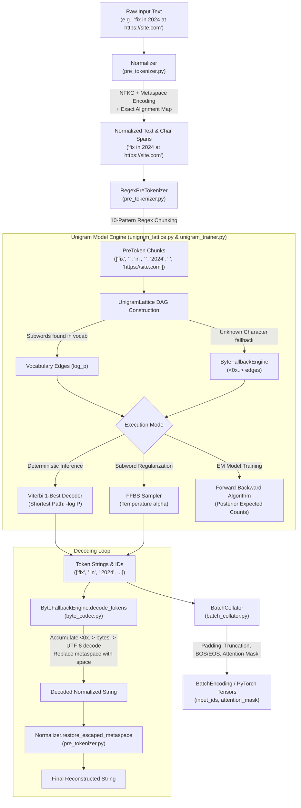

# Caliper Tokenizer Architecture & Codebase Technical Guide

An exhaustive, end-to-end technical reference for the **Caliper** tokenizer — a zero-dependency, high-precision, Byte-Fallback Unigram Language Model tokenizer featuring dual-offset character span tracking, forward-filtering backward-sampling (FFBS) subword regularization, multilingual Unicode script isolation, and non-destructive online vocabulary adaptation.

---

## Table of Contents
1. [Core Architectural Philosophy & Main Theme](#1-core-architectural-philosophy--main-theme)
2. [End-to-End Pipeline & Data Flow](#2-end-to-end-pipeline--data-flow)
3. [Exhaustive File-by-File Breakdown](#3-exhaustive-file-by-file-breakdown)
   - [3.1 `byte_codec.py` — Byte Fallback Codec](#31-byte_codecpy--byte-fallback-codec)
   - [3.2 `pre_tokenizer.py` — Dual-Offset Normalizer & Regex Pre-Tokenizer](#32-pre_tokenizerpy--dual-offset-normalizer--regex-pre-tokenizer)
   - [3.3 `seed_builder.py` — Seed Vocabulary Mining & Base Floor Builder](#33-seed_builderpy--seed-vocabulary-mining--base-floor-builder)
   - [3.4 `unigram_lattice.py` — Directed Acyclic Graph (DAG), Viterbi, EM & FFBS](#34-unigram_latticepy--directed-acyclic-graph-dag-viterbi-em--ffbs)
   - [3.5 `unigram_trainer.py` — Expectation-Maximization (EM) & Likelihood Pruning](#35-unigram_trainerpy--expectation-maximization-em--likelihood-pruning)
   - [3.6 `vocab_adapter.py` — Dynamic Online Vocabulary Expansion](#36-vocab_adapterpy--dynamic-online-vocabulary-expansion)
   - [3.7 `batch_collator.py` — Transformer Batch Padding, Masking & Tensors](#37-batch_collatorpy--transformer-batch-padding-masking--tensors)
   - [3.8 `tokenizer.py` — Unified High-Level Facade & Serialization](#38-tokenizerpy--unified-high-level-facade--serialization)
   - [3.9 `saved_model/tokenizer.json` — Serialized Model Artifact](#39-saved_modeltokenizerjson--serialized-model-artifact)
   - [3.10 `test_tokenizer.py` — Test Suite & Verification Invariants](#310-test_tokenizerpy--test-suite--verification-invariants)
   - [3.11 Workspace Artifacts (`README.md`, `Architectures.txt`, License/Git)](#311-workspace-artifacts-readmemd-architecturestxt-licensegit)
4. [Mathematical & Algorithmic Foundations](#4-mathematical--algorithmic-foundations)
5. [Inference vs. Training Execution Traces](#5-inference-vs-training-execution-traces)

---

## 1. Core Architectural Philosophy & Main Theme

Modern subword tokenizers (e.g., standard BPE or WordPiece implementations) suffer from several systemic vulnerabilities when deployed in production LLM pipelines:
1. **Out-of-Vocabulary (OOV) Catastrophe**: Rare unicode characters, emojis, or foreign scripts get replaced with `<unk>`, causing total information loss.
2. **Span Drift & Alignment Failure**: Normalization steps (like Unicode NFKC or case folding) alter string lengths, destroying character span indices needed for extractive QA, Named Entity Recognition (NER), and fine-grained citations.
3. **Monolithic Digit / Script Clumping**: Numbers and mixed scripts clump together (e.g., `2024` or `https://` treated as single arbitrary tokens), breaking mathematical reasoning and URL parsing.
4. **Deterministic Subword Brittleness**: Standard deterministic segmentation makes models sensitive to typos, spelling variants, and noise.
5. **Vocabulary Freezing**: Extending a trained vocabulary usually requires shifting or re-indexing tokens, which corrupts the downstream Transformer embedding matrix \(W_e\).

**Caliper** resolves these failure modes via a pure-Python, zero-dependency engine combining:
- **Strict Byte Fallback**: Individual unknown bytes are mapped to `<0x00>` through `<0xFF>`, ensuring **0% OOV** rate and exact, lossless roundtrip decoding.
- **Cluster-Aware Dual-Offset Tracking**: Every transformation in the normalizer maintains a mapping `alignment_map[norm_char_idx] -> (raw_start, raw_end)` in the original raw text.
- **Regex Boundary Protection**: Multilingual combining mark protection (Indic viramas, Arabic harakat, Hebrew niqqud), RFC-compliant URL preservation, emoji ZWJ sequence binding, and optional digit splitting.
- **Unigram Lattice Formulation**: Formulates segmentation as a probabilistic shortest-path search across a Directed Acyclic Graph (DAG) using dynamic programming (Viterbi), Expectation-Maximization (EM) training, and Forward-Filtering Backward-Sampling (FFBS) for subword regularization.
- **Non-Destructive Vocabulary Expansion**: Adds domain-specific tokens at the end of the vocabulary (`id = len(old_vocab) + i`), leaving existing token IDs and embedding rows untouched.

---

## 2. End-to-End Pipeline & Data Flow

---

## 3. Exhaustive File-by-File Breakdown

---

### 3.1 `byte_codec.py` — Byte Fallback Codec

[byte_codec.py](file:///c:/Users/shaik/Research/Tokenizer/byte_codec.py) implements the low-level byte fallback mechanism that guarantees 100% token coverage without out-of-vocabulary (`<unk>`) token dropping.

#### Key Class: `ByteFallbackEngine`
- **`BYTE_TOKEN_PATTERN = re.compile(r"^<0x([0-9A-Fa-f]{2})>$")`**:
  Strict regex pattern verifying whether a token string is an explicit hexadecimal byte representation (e.g., `<0x0A>`, `<0xE2>`).
- **`is_byte_token(cls, token: str) -> bool`**:
  Validates if a token matches the byte token format.
- **`byte_to_token(cls, byte_val: int) -> str`**:
  Converts an integer `0 <= byte_val <= 255` into its 2-digit uppercase hex representation (e.g., `226 -> "<0xE2>"`). Raises `ValueError` if outside `[0, 255]`.
- **`token_to_byte(cls, token: str) -> int`**:
  Parses `<0xHH>` to its integer byte value `int(hex, 16)`. Raises `ValueError` on malformed tokens.
- **`char_to_byte_tokens(cls, char_or_str: str) -> List[str]`**:
  Encodes any arbitrary string/character into its underlying raw UTF-8 bytes using Python's `.encode("utf-8")`, then maps each byte to its `<0xHH>` token.
  *Example*: `"\u2581"` (3 UTF-8 bytes `0xE2 0x96 0x81`) becomes `["<0xE2>", "<0x96>", "<0x81>"]`.
- **`decode_tokens(cls, tokens: List[str], space_char: str = "\u2581") -> str`**:
  State-machine decoder. It iterates through a list of tokens:
  1. If a token is a byte fallback token (`<0x..>`), it pushes the raw byte value into an internal `byte_buffer: bytearray`.
  2. When a non-byte token or end-of-stream is reached, it flushes `byte_buffer` by executing `byte_buffer.decode("utf-8")`. If the byte sequence is invalid UTF-8, it raises `UnicodeDecodeError` rather than silently injecting replacement characters (`\uFFFD`).
  3. Learned subwords have their metaspace character (`\u2581`) replaced with regular spaces `" "`, while bytes decoded from fallback tokens are never subject to metaspace replacement.

---

### 3.2 `pre_tokenizer.py` — Dual-Offset Normalizer & Regex Pre-Tokenizer

[pre_tokenizer.py](file:///c:/Users/shaik/Research/Tokenizer/pre_tokenizer.py) handles text sanitization, Unicode canonicalization, whitespace conversion, and regex-based linguistic boundary chunking while preserving exact character coordinate spans.

#### Data Structures
- **`RawSpan = Tuple[int, int]`**: Represents start and end character offsets `(start, end)` in the original raw text.
- **`PreToken`**: Dataclass containing:
  - `text: str`: The normalized string chunk.
  - `norm_span: Tuple[int, int]`: Character slice in the normalized string.
  - `raw_span: Tuple[int, int]`: Exact corresponding character slice in the original source document.

#### Key Class: `Normalizer`
Standardizes raw text with fine-grained tracking of transformations:
- **`PUNCT_MAP`**: Translates typographic curly quotes (`“ ” „ ‘ ’ ‚`), em/en dashes (`— – −`), and horizontal ellipses (`…`) to their ASCII equivalents (`"`, `'`, `-`, `...`).
- **`UNICODE_SPACES`**: Explicit string containing 16 distinct Unicode whitespace codepoints (including non-breaking space `\u00A0`, em quad `\u2001`, thin space `\u2009`, ideographic space `\u3000`, narrow no-break space `\u202F`).
- **Escape Constants**:
  - `_ESCAPE_PREFIX = "\uE000"`
  - `_ESCAPED_METASPACE = "\uE001"`
  Used to escape pre-existing literal metaspace characters (`\u2581`) in the source text so they are not confused with tokenizer whitespace markers.
- **`_is_hangul_jamo(char: str) -> bool`**: Identifies Korean Hangul Jamo codepoint ranges (`0x1100-0x11FF`, `0xA960-0xA97C`, `0xD7B0-0xD7FB`).
- **`_normalize_nfkc_with_alignment(text: str) -> Tuple[List[str], List[RawSpan]]`**:
  Applies Unicode NFKC normalization in normalization-safe clusters (preserving Hangul combining sequences and Unicode combining marks) while producing a 1-to-1 character alignment map where `alignment_map[norm_index] = (raw_start, raw_end)`.
- **`normalize_with_alignment(text: str) -> Tuple[str, List[RawSpan]]`**:
  Sequentially applies:
  1. Unicode NFKC normalization.
  2. Non-standard Unicode space normalization to ASCII space `" "`.
  3. Punctuation normalization (if enabled).
  4. Lowercasing (if enabled).
  5. Whitespace collapsing and stripping (if enabled).
  6. Metaspace conversion: transforms ASCII space `" "` to `\u2581` while escaping literal `\u2581` using `\uE000\uE001`.

#### Key Class: `RegexPreTokenizer`
Splits normalized text into isolated semantic chunks so that Unigram subwords do not span across incompatible linguistic boundaries (e.g., preventing a subword from combining digits and words or bridging across URL boundaries).

- **`COMBINING_MARKS`**: Regex range covering Indic scripts (Devanagari, Bengali, Tamil, Telugu, Kannada, Malayalam, Gurmukhi, Gujarati, Oriya), Arabic, Hebrew, Thai, and Latin combining diacritics (`\u0300-\u036F`, `\u0590-\u08FF`, `\u0900-\u0DFF`, `\u0E00-\u0E7F`, `\u1DC0-\u1DFF`, `\u20D0-\u20FF`, `\uFE20-\uFE2F`).
- **10 Core Boundary Patterns**:
  1. `special_token`: Captures user-defined special control sequences (e.g., `<|user|>`, `<|endoftext|>`).
  2. `url`: Strict RFC-compliant URL matcher (`https?://...`) that avoids consuming trailing sentence punctuation (`. , ; ! ?`).
  3. `email`: Standard email address matcher (`user@domain.com`).
  4. `hashtag` / `mention`: Social tags (`#tag`, `@user`).
  5. `emoji`: Matches complex Unicode emojis including Zero Width Joiner (ZWJ `\u200D`) chains, skin-tone modifiers, and variation selectors (`\uFE0E`, `\uFE0F`).
  6. `cjk`: Isolates individual CJK ideographs (`\u4e00-\u9fff`, `\uac00-\ud7af`) to prevent monolithic East Asian block tokens.
  7. `word`: Multilingual alphabetic words incorporating attached combining marks / viramas / matras.
  8. `number`: Single digits (if `split_digits=True`) or continuous integer sequences (`\d+`).
  9. `space_marker` / `whitespace`: Metaspace runs (`\u2581+`) and whitespace chunks.
  10. `punctuation`: Punctuation marks and symbols.
- **`pre_tokenize_with_offsets(normalized_text, alignment_map)`**:
  Executes regex matching across `normalized_text` and uses `alignment_map` to calculate the exact `(raw_start, raw_end)` span in the source text for each `PreToken`.

---

### 3.3 `seed_builder.py` — Seed Vocabulary Mining & Base Floor Builder

[seed_builder.py](file:///c:/Users/shaik/Research/Tokenizer/seed_builder.py) creates the initial candidate vocabulary pool before Unigram EM optimization starts.

#### Data Structures
- **`SeedToken`**: Dataclass holding:
  - `token: str`: Token string representation.
  - `frequency: int`: Total frequency in training corpus.
  - `is_required: bool`: Protection flag (`True` for special tokens, 256 byte fallbacks, and base alphabet characters). **Required tokens are strictly immune to pruning during EM iterations.**
  - `source: str`: Source tag (`"special"`, `"byte"`, `"alphabet"`, `"ngram"`).
  - `length: int`: Character length.

#### Key Class: `SeedVocabularyBuilder`
- **Irreducible Base Floor**:
  - `collect_special_tokens()`: Collects all special tokens (`<|pad|>`, `<|unk|>`, `<|bos|>`, `<|eos|>`, `<|endoftext|>`, `<|user|>`, `<|assistant|>`, `<|system|>`).
  - `collect_byte_tokens()`: Generates all 256 byte tokens `<0x00>` through `<0xFF>`.
  - `collect_base_alphabet(chunk_counts)`: Collects every individual single character present in the corpus.
- **Floor Validation**:
  `num_required = len(special) + len(bytes) + len(alphabet)`. If `target_vocab_size < num_required`, raises a `ValueError` with clear guidance.
- **`mine_ngrams(chunk_counts)`**:
  Extracts all character n-grams from length 1 up to `max_ngram_length` across all pre-tokenized chunks, skipping special token strings.
- **`filter_candidates(ngram_counts, protected_tokens)`**:
  Filters out any n-grams that are already protected or whose frequency is below `min_frequency`.
- **`rank_candidates(candidate_counts)`**:
  Ranks candidate n-grams deterministically using:
  - **`char_savings` Strategy**: Score = \(-(\text{len}(t) - 1) \times \text{frequency}\). Measures how many characters are saved by substituting this single token for individual characters.
  - **Secondary / Tertiary / Quaternary Keys**: `-frequency`, `-length`, and lexicographical string ascending for guaranteed deterministic tie-breaking.
- **`build_seed_vocab(pre_tokenized_chunks)`**:
  Combines required tokens and top ranked candidates up to `seed_vocab_size = int(target_vocab_size * seed_multiplier)` (default \(3.0\times\)).

---

### 3.4 `unigram_lattice.py` — Directed Acyclic Graph (DAG), Viterbi, EM & FFBS

[unigram_lattice.py](file:///c:/Users/shaik/Research/Tokenizer/unigram_lattice.py) implements the core mathematical Directed Acyclic Graph (DAG) for a given text segment.

#### Numerically Stable Math
- **`logsumexp(log_probs: List[float]) -> float`**:
  Calculates \( \log \sum_{i} \exp(x_i) \) using the max-subtraction identity:
  \[
  \text{logsumexp}(x) = x_{\max} + \log \left( \sum_{i} \exp(x_i - x_{\max}) \right)
  \]
  Prevents floating point underflow and overflow in log-space probability calculations.

#### Data Structures
- **`LatticeEdge`**: Dataclass representing a directed graph edge from character position `start` to `end`:
  - `tokens: List[str]`: Subword token or byte fallback tokens for this edge.
  - `log_prob: float`: \( \log P(\text{token}) \).
  - `cost: float`: Shortest-path edge weight \( -\log P(\text{token}) \).

#### Key Class: `UnigramLattice`
Constructs a DAG where node \(i\) represents character boundary \(i\) (\(0 \le i \le N\)).

- **`_build_graph()`**:
  Populates `begin_nodes[i]` (outgoing edges) and `end_nodes[j]` (incoming edges).
  - For each position \(i\), checks all substrings `text[i:j]` up to `max_subword_len`. If a substring exists in `vocab`, adds a `LatticeEdge`.
  - **Byte Fallback Edge**: If no vocabulary subword starts at position \(i\) and `byte_fallback=True`, decomposes `text[i]` into UTF-8 byte tokens using `ByteFallbackEngine.char_to_byte_tokens` with `DEFAULT_BYTE_PENALTY = 10.0` to guarantee connectivity from \(i\) to \(i+1\).
- **`viterbi_edges()` & `viterbi()` (1-Best Deterministic Inference)**:
  Uses dynamic programming to find the path that minimizes total cost \( \sum -\log P(t_i) \) (which maximizes joint log-likelihood \( \sum \log P(t_i) \)):
  \[
  \text{best\_cost}[j] = \min_{e \in \text{end\_nodes}[j]} (\text{best\_cost}[e.\text{start}] + e.\text{cost})
  \]
  Traces backward from \(N\) to \(0\) to recover the optimal segmentation.
- **`forward_backward()` (Expectation Step for Training)**:
  Computes posterior expectations over all exponential segmentations of the string:
  - **Forward Pass**: \( \alpha[j] = \log \sum_{e \in \text{end\_nodes}[j]} \exp(\alpha[e.\text{start}] + \log P(e)) \).
  - **Backward Pass**: \( \beta[i] = \log \sum_{e \in \text{begin\_nodes}[i]} \exp(\log P(e) + \beta[e.\text{end}]) \).
  - **Total Marginal**: \( \log P(\text{text}) = \alpha[N] \).
  - **Edge Posterior**:
    \[
    P(e \mid \text{text}) = \exp(\alpha[e.\text{start}] + \log P(e) + \beta[e.\text{end}] - \alpha[N])
    \]
  Returns expected token occurrences \(E[\text{count}(t)]\) and total marginal log-likelihood.
- **`sample(alpha: float = 0.5)` (Subword Regularization via FFBS)**:
  Forward-Filtering Backward-Sampling algorithm:
  1. Computes temperature-scaled forward scores:
     \[
     \alpha[j] = \text{logsumexp}_{e \in \text{end\_nodes}[j]} (\alpha[e.\text{start}] + \alpha_{\text{temp}} \cdot \log P(e))
     \]
  2. Steps backwards from \(curr = N\) to \(0\), computing edge transition probabilities via softmax normalization, and samples an incoming edge according to its categorical distribution.

---

### 3.5 `unigram_trainer.py` — Expectation-Maximization (EM) & Likelihood Pruning

[unigram_trainer.py](file:///c:/Users/shaik/Research/Tokenizer/unigram_trainer.py) manages the training loop that reduces the initial seed vocabulary pool down to the exact `target_vocab_size`.

#### Data Structures
- **`UnigramModel`**: Dataclass representing the trained model state:
  - `vocab: Dict[str, float]`: Token-to-log-probability mapping.
  - `token_to_id: Dict[str, int]`: Token-to-integer-ID dictionary.
  - `id_to_token: Dict[int, str]`: Reverse integer-ID-to-token dictionary.
  - `special_tokens: List[str]`: List of registered special tokens.
  - `encode(text)`: 1-Best Viterbi tokenization.
  - `encode_with_spans(text)`: Returns `(token, norm_start, norm_end)`.
  - `sample(text, alpha)`: Stochastic FFBS tokenization.
  - `encode_to_ids(text)` / `sample_to_ids(text, alpha)`: Encodes directly to token IDs.
  - `decode(token_ids)`: Decodes IDs back to string via `ByteFallbackEngine`.

#### Key Class: `UnigramTrainer`
- **Training Algorithm Flow**:
  1. **Seed Initialization**: Invokes `SeedVocabularyBuilder` to obtain \( \approx 3 \times \text{target\_vocab\_size} \) tokens. Computes initial log-probabilities from seed frequencies.
  2. **Iterative EM & Pruning Loop** (runs while `len(vocab) > target_vocab_size`):
     - **E-Step**: For each text chunk in the corpus, constructs a `UnigramLattice` and runs `forward_backward()` to accumulate expected token frequencies \(E[c(t)]\).
     - **M-Step**: Updates log probabilities:
       \[
       \log P(t) = \log \frac{E[c(t)]}{\sum_{w} E[c(w)]}
       \]
       Repeated for `em_sub_iterations` (default 2).
     - **Pruning Step**: Calculates the contribution score for each non-required token:
       \[
       \text{Score}(t) = E[c(t)] \times \log P(t)
       \]
       (Tokens whose score is closest to zero contribute least to the corpus likelihood). Sorts candidate scores and prunes the lowest `prune_rate` (default 20%) fraction. Required tokens are never pruned.
  3. **Probability Re-normalization**: Re-computes exact valid probability distribution over surviving tokens.
  4. **Deterministic Token ID Assignment**: Orders tokens deterministically:
     - Group 0: Special control tokens (`<|...|>`).
     - Group 1: 256 Byte fallback tokens (`<0x00>` .. `<0xFF>`).
     - Group 2: Alphabet and mined subwords (sorted by length descending, then lexicographical string ascending).

---

### 3.6 `vocab_adapter.py` — Dynamic Online Vocabulary Expansion

[vocab_adapter.py](file:///c:/Users/shaik/Research/Tokenizer/vocab_adapter.py) provides non-destructive online vocabulary adaptation for existing models.

#### Key Class: `VocabularyAdapter`
When fine-tuning an LLM on a new domain (e.g., biomedical text, Python source code, or new slang):
- **Preservation of Existing Embedding Rows**:
  Existing token IDs \(0 \le \text{ID} < V_{\text{old}}\) remain completely unchanged. New tokens are appended contiguously starting at \(V_{\text{old}}\), preventing catastrophic forgetting or weight misalignment in the Transformer's token embedding matrix \(W_e\).
- **`expand_vocabulary(...) -> CustomTokenizer`**:
  1. Normalizes and pre-tokenizes the new domain corpus.
  2. Mines new candidate n-grams using `SeedVocabularyBuilder.mine_ngrams`.
  3. Filters out any tokens already present in the existing vocabulary.
  4. Assigns new contiguous IDs starting from `len(old_model.token_to_id)`.
  5. Computes prior probabilities for new tokens based on new domain occurrences and re-normalizes the full probability distribution.
  6. Instantiates and returns a new `CustomTokenizer` wrapping the expanded `UnigramModel`.

---

### 3.7 `batch_collator.py` — Transformer Batch Padding, Masking & Tensors

[batch_collator.py](file:///c:/Users/shaik/Research/Tokenizer/batch_collator.py) converts lists of variable-length texts into aligned, padded 2D matrices ready for Transformer attention mechanisms.

#### Data Structures
- **`BatchEncoding`**: Dataclass containing:
  - `input_ids: List[List[int]]`: 2D list of shape `[batch_size, seq_len]`.
  - `attention_mask: List[List[int]]`: 2D binary mask (`1` for real tokens, `0` for padding tokens).
  - `tokens: List[List[str]]`: 2D list of token strings aligned with `input_ids`.
  - `to_dict() -> dict`: Returns dictionary with `"input_ids"` and `"attention_mask"`.
  - `to_torch() -> dict`: Converts lists to PyTorch `torch.long` tensors if PyTorch is installed.

#### Key Class: `BatchCollator`
- **`batch_encode(...) -> BatchEncoding`**:
  - Encodes raw strings using either deterministic Viterbi (`sample=False`) or subword regularization (`sample=True, alpha=0.5`).
  - Injects `<|bos|>` at sequence start and `<|eos|>` at sequence end if configured.
  - Applies truncation to `max_length` if `truncation=True`.
  - Computes batch maximum sequence length and dynamically pads shorter sequences with `pad_id` (`<|pad|>`) while populating `attention_mask` with zeros on padded slots.

---

### 3.8 `tokenizer.py` — Unified High-Level Facade & Serialization

[tokenizer.py](file:///c:/Users/shaik/Research/Tokenizer/tokenizer.py) is the top-level user-facing module that unites the normalizer, pre-tokenizer, and Unigram model into a clean interface.

#### Data Structures
- **`Token`**: Dataclass returned by `encode_with_offsets`:
  - `text: str`: Token string.
  - `id: int`: Integer vocabulary ID.
  - `raw_span: Tuple[int, int]`: Character span in the original raw input string.

#### Key Class: `CustomTokenizer`
- **`train_from_corpus(corpus, ...)`**: Factory class method that constructs the Normalizer, RegexPreTokenizer, and UnigramTrainer, executing full EM training and returning an instantiated `CustomTokenizer`.
- **Core Inference Methods**:
  - `encode(text) -> List[str]`: Returns list of subword/byte token strings.
  - `encode_to_ids(text) -> List[int]`: Returns list of integer token IDs.
  - `sample(text, alpha=0.5) -> List[str]`: Returns stochastically sampled subword strings.
  - `sample_to_ids(text, alpha=0.5) -> List[int]`: Returns stochastically sampled token IDs.
  - `encode_with_offsets(text) -> List[Token]`: Propagates character offsets through the normalizer's cluster alignment map and lattice edge start/end indices, mapping every subword token directly back to `(raw_start, raw_end)` in the original raw input text.
  - `decode(token_ids) -> str`: Converts integer IDs back into strings, flushes byte buffers, and restores escaped metaspaces.
- **Serialization**:
  - `save(directory)`: Serializes vocabulary, log probabilities, ID mappings, special tokens, normalizer parameters, and pre-tokenizer configuration into `tokenizer.json`.
  - `load(directory)`: Deserializes `tokenizer.json` and reconstructs the full tokenizer pipeline.

---

### 3.9 `saved_model/tokenizer.json` — Serialized Model Artifact

[saved_model/tokenizer.json](file:///c:/Users/shaik/Research/Tokenizer/saved_model/tokenizer.json) contains a complete saved snapshot of a trained Caliper tokenizer.
- Contains all subword tokens and their learned log-probabilities (`vocab`).
- Maps each token to its deterministic integer ID (`token_to_id`).
- Defines `special_tokens` (`<|pad|>`, `<|unk|>`, `<|bos|>`, `<|eos|>`, `<|endoftext|>`, `<|user|>`, `<|assistant|>`, `<|system|>`).
- Preserves all normalizer flags (`normalize_unicode`, `normalize_punctuation`, `collapse_whitespaces`, etc.) and pre-tokenizer configurations (`split_digits`, `special_token_pattern`).

---

### 3.10 `test_tokenizer.py` — Test Suite & Verification Invariants

[test_tokenizer.py](file:///c:/Users/shaik/Research/Tokenizer/test_tokenizer.py) contains 16 automated unit tests validating all critical invariants:
1. **`NormalizerTests`**:
   - `test_nfkc_composes_across_codepoints_and_preserves_raw_span`: Verifies that decomposing characters (e.g., `"A\u030A"` \(\to\) `"\u00C5"`) retains raw character span `(0, 2)`.
   - `test_whitespace_options_are_applied`: Tests whitespace collapsing and alignment tracking.
   - `test_rejects_misaligned_offset_map`: Ensures length mismatch raises `ValueError`.
   - `test_escapes_literal_metaspace_and_escape_prefix`: Validates reversible escaping of `\u2581` and `\uE000`.
2. **`ByteFallbackTests`**:
   - `test_byte_decoding_preserves_literal_metaspace`: Verifies byte decoding handles metaspaces correctly.
   - `test_invalid_byte_sequence_is_rejected`: Verifies `UnicodeDecodeError` on invalid byte sequences (e.g., isolated `<0xFF>`).
   - `test_subwords_still_decode_metaspace`: Verifies subwords convert metaspaces to spaces.
3. **`CustomTokenizerTests`**:
   - `test_subword_offsets_are_exact`: Tests dual-offset span emission on subwords.
   - `test_save_load_preserves_lattice_settings`: Verifies full JSON serialization and deserialization fidelity.
   - `test_vocabulary_adapter_preserves_model_settings_and_ids`: Confirms online vocabulary expansion preserves existing IDs.
4. **`LatticeTests`**:
   - `test_rejects_invalid_sampling_temperature`: Rejects `alpha <= 0` or NaN.
   - `test_forward_backward_rejects_disconnected_lattice`: Detects and errors on disconnected graphs.
   - `test_rejects_invalid_lattice_length`: Rejects `max_subword_len < 1`.
5. **`TrainerValidationTests`**:
   - `test_rejects_invalid_training_configuration`: Validates hyperparameters (`prune_rate`, `em_sub_iterations`).
6. **`BatchCollatorTests`**:
   - `test_padding_keeps_tokens_aligned_with_ids`: Tests aligned padding of tokens and input IDs.
   - `test_rejects_overlong_sequence_without_truncation`: Rejects sequence exceeding max length when truncation is disabled.

---

### 3.11 Workspace Artifacts (`README.md`, `Architectures.txt`, License/Git)

- **[README.md](file:///c:/Users/shaik/Research/Tokenizer/README.md)**: Concise project manifesto describing Caliper as a zero-dependency Byte-Fallback Unigram tokenizer.
- **[Architectures.txt](file:///c:/Users/shaik/Research/Architectures.txt)**: High-level architectural notes in the workspace covering deep learning paradigms (CNNs, RNNs, Transformers, GANs, Autoencoders, and Attention mechanisms).
- **`LICENSE` / `.gitignore`**: Standard MIT license and git ignore configuration.

---

## 4. Mathematical & Algorithmic Foundations

### Unigram Language Model Formulation
Given a sequence of characters \(X = (c_1, c_2, \dots, c_N)\), the probability of a segmentation \(S = (t_1, t_2, \dots, t_M)\) where \(X = t_1 \circ t_2 \circ \dots \circ t_M\) is defined under the Unigram model as:
\[
P(S) = \prod_{i=1}^M P(t_i)
\]
Subject to the probability simplex constraint:
\[
\sum_{t \in V} P(t) = 1, \quad P(t) \ge 0
\]

### Viterbi 1-Best Optimal Search
To find the most probable segmentation \(S^*\):
\[
S^* = \arg\max_{S \in \mathcal{S}(X)} \prod_{t \in S} P(t) = \arg\min_{S \in \mathcal{S}(X)} \sum_{t \in S} \big(-\log P(t)\big)
\]
This is solved in \(O(N \cdot L)\) time (where \(L\) is `max_subword_len`) using dynamic programming on the lattice DAG:
\[
\text{Cost}(j) = \min_{i < j, \, X[i:j] \in V} \Big( \text{Cost}(i) - \log P(X[i:j]) \Big)
\]

### Forward-Backward EM Computation
For training on corpus \(\mathcal{D}\), the expected frequency of token \(t\) across all possible segmentations of all sentences is:
\[
E[c(t)] = \sum_{X \in \mathcal{D}} \sum_{e = (i, j, t) \in \text{Edges}(X)} \frac{\alpha[i] \cdot P(t) \cdot \beta[j]}{\alpha[N]}
\]
In the M-step, probabilities are re-estimated via Maximum Likelihood Estimation:
\[
P^{\text{new}}(t) = \frac{E[c(t)]}{\sum_{w \in V} E[c(w)]}
\]

---

## 5. Inference vs. Training Execution Traces

### Inference Trace (`tokenizer.encode_with_offsets("fix in 2024")`)
1. **Raw Text**: `"fix in 2024"` (Length: 11 characters).
2. **Normalizer**:
   - NFKC normalizes `"fi"` (\(U+FB01\)) \(\to\) `"fix"` (Length becomes 12 characters).
   - Spaces become `\u2581`.
   - Result: `"fix\u2581in\u25812024"`.
   - Alignment map maps indices `0, 1, 2` of `"fix"` back to `(0, 1)` of `"fix"`.
3. **RegexPreTokenizer**:
   - Emits PreTokens: `[PreToken("fix"), PreToken("\u2581in"), PreToken("\u25812024")]`.
4. **UnigramLattice**:
   - For each pre-token, constructs DAG and solves Viterbi shortest path.
   - Emits subwords: `["fix", "\u2581in", "\u25812024"]` (or `["\u258120", "24"]` depending on vocab).
5. **Offset Projection**:
   - Slices through `alignment_map` to assign `(0, 1)` to `"fix"`, `(3, 6)` to `"\u2581in"`, and `(6, 11)` to `"\u25812024"`.
6. **Token Emission**:
   - `[Token(text='fix', id=104, raw_span=(0, 1)), Token(text=' in', id=42, raw_span=(3, 6)), Token(text=' 2024', id=89, raw_span=(6, 11))]`.

### Training Trace (`CustomTokenizer.train_from_corpus(corpus)`)
1. **Corpus Ingestion**: Normalizes and pre-tokenizes all raw documents.
2. **Seed Generation**: Collects special tokens (\(8\)) + Byte tokens (\(256\)) + Base alphabet (\(A\)) + Mined n-grams \(\to\) Seed vocabulary size (\(3 \times \text{target}\)).
3. **EM Loop**:
   - Iteration 1..K: Computes forward-backward expected counts across all corpus lattices. Updates log probabilities.
   - Pruning: Scores candidate tokens by \(E[c(t)] \cdot \log P(t)\). Discards bottom 20% lowest-scoring candidates. Protects required floor.
4. **Final Normalization & ID Ordering**: Sorts into deterministic ID order and returns production-ready `CustomTokenizer`.
